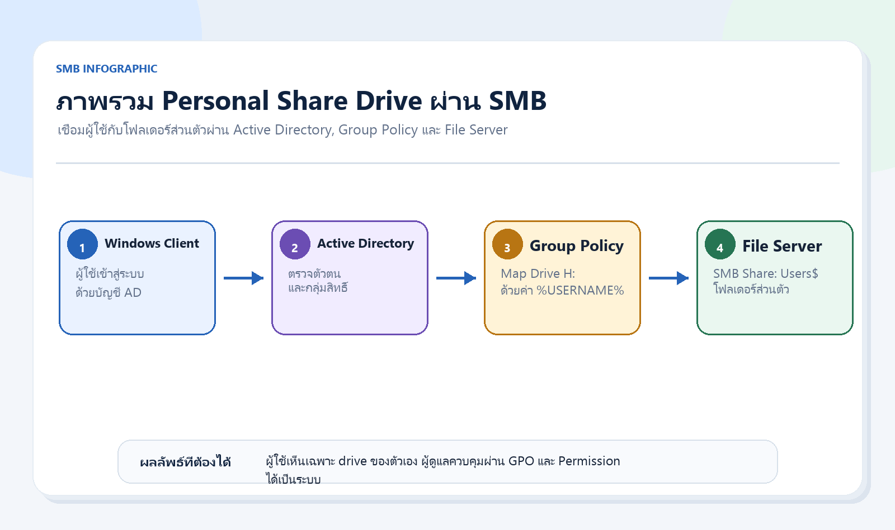
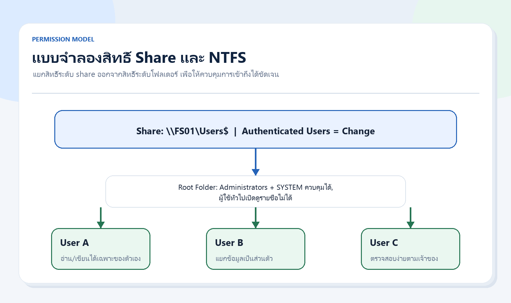
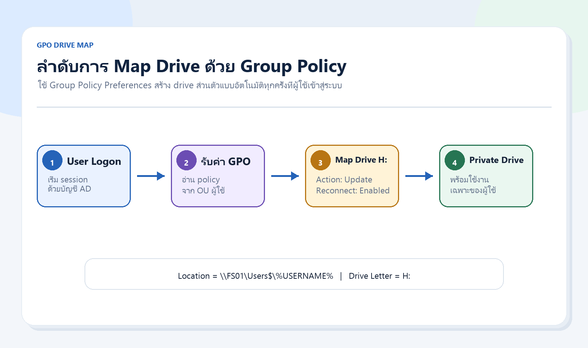

# คู่มือการจัดทำ Personal Share Drive ด้วย SMB และ GPO

สำหรับบุคลากรภายในองค์กร โดยจำกัดสิทธิ์ให้เข้าถึงเฉพาะพื้นที่ส่วนตัวของตนเอง

> [!summary] ใช้เมื่อไร
> ใช้คู่มือนี้เมื่อต้องจัดทำพื้นที่เก็บไฟล์ส่วนตัวของผู้ใช้บน Windows File Server โดย map drive อัตโนมัติผ่าน GPO และต้องการควบคุมสิทธิ์ให้ผู้ใช้เห็นเฉพาะข้อมูลของตนเอง

## 1. วัตถุประสงค์

เอกสารฉบับนี้กำหนดแนวทางการจัดทำ file share โดยใช้ SMB สำหรับเป็น share drive ส่วนตัวของบุคลากร และกำหนด Group Policy Object (GPO) เพื่อ map drive ให้ผู้ใช้แต่ละรายโดยอัตโนมัติ

## 2. ขอบเขต

- Windows Server ที่ทำหน้าที่เป็น File Server
- Active Directory Domain Services
- Group Policy Management
- เครื่องลูกข่าย Windows ที่เข้าร่วมโดเมน
- บัญชีผู้ใช้ที่อยู่ใน OU หรือกลุ่มที่องค์กรกำหนด
- ไม่ครอบคลุมการทำ DFS Namespace, file classification, DLP หรือ migration จาก file server เดิม

## 3. หลักการออกแบบ

ใช้ SMB share เดียวแบบซ่อนชื่อ เช่น `Users$` แล้วแยกโฟลเดอร์รายบุคคลภายใต้ root เดียวกัน โดยให้ GPO map drive ของผู้ใช้ไปยังโฟลเดอร์ที่ตรงกับชื่อบัญชีโดเมนของผู้ใช้นั้นโดยอัตโนมัติ



แนวทางสำคัญมีดังนี้

- ใช้ NTFS Permission เป็นกลไกหลักในการจำกัดสิทธิ์
- ผู้ใช้แต่ละรายได้รับสิทธิ์ `Modify` เฉพาะโฟลเดอร์ของตนเอง
- เปิด Access-Based Enumeration เพื่อไม่แสดงโฟลเดอร์ที่ผู้ใช้ไม่มีสิทธิ์เข้าถึง
- ใช้ตัวแปร `%USERNAME%` ใน GPO เพื่อลดการกำหนด path รายบุคคล

## 4. ข้อกำหนดก่อนดำเนินการ

| หัวข้อ | ข้อกำหนด |
|---|---|
| Server | Windows Server ที่ติดตั้ง File Server role และเข้าร่วมโดเมนแล้ว |
| Storage | เตรียม volume สำหรับข้อมูลผู้ใช้ เช่น `D:\Shares\Users` |
| AD | มีบัญชีผู้ใช้ใน OU ที่ต้องการ และชื่อ logon ตรงกับชื่อโฟลเดอร์ส่วนตัว |
| Admin Group | แนะนำให้สร้างกลุ่ม Domain Local เช่น `FileShare-Admins` |
| Change Control | สำรองค่าปัจจุบัน กำหนดช่วงเวลาดำเนินการ และแจ้งผู้เกี่ยวข้องก่อนใช้งานจริง |

> [!warning] ข้อมูลผู้ใช้
> Share ส่วนตัวอาจมีข้อมูลสำคัญหรือข้อมูลส่วนบุคคล ต้องกำหนด backup, retention, audit และสิทธิ์ผู้ดูแลระบบให้ชัดเจนก่อนเปิดใช้งานจริง

## 4.1 ข้อมูลที่ต้องเตรียม

| รายการ | ตัวอย่าง | หมายเหตุ |
|---|---|---|
| File Server | `FS01` | ควรมี DNS record ที่เสถียร |
| Share Name | `Users$` | ใช้ `$` เพื่อซ่อนจาก browse ทั่วไป |
| Root Path | `D:\Shares\Users` | แยก volume จาก OS หากทำได้ |
| Drive Letter | `H:` | ตรวจไม่ชนกับ drive อื่นขององค์กร |
| User Scope | OU หรือ security group | ใช้จำกัด GPO scope |
| Admin Group | `CONTOSO\FileShare-Admins` | ทบทวนสมาชิกเป็นประจำ |
| Backup Policy |  | ระบุ retention และ restore owner |

## 5. สร้างโครงสร้างโฟลเดอร์และ SMB Share

1. เข้าสู่ระบบ File Server ด้วยบัญชีผู้ดูแลระบบที่ได้รับอนุมัติ
2. สร้างโฟลเดอร์หลัก เช่น `D:\Shares\Users`
3. สร้าง SMB Share ชื่อ `Users$` เพื่อซ่อน share จากการ browse ทั่วไป
4. เปิด Access-Based Enumeration
5. กำหนด Share Permission ให้กลุ่มผู้ใช้เข้าถึง share ได้ในระดับ `Change` และให้ผู้ดูแลระบบเป็น `Full Control`
6. เปิด SMB Encryption หากนโยบายองค์กรกำหนดและเครื่องลูกข่ายรองรับ

ตัวอย่างคำสั่ง PowerShell:

```powershell
$Root = 'D:\Shares\Users'
New-Item -ItemType Directory -Path $Root -Force

New-SmbShare -Name 'Users$' -Path $Root `
  -ChangeAccess 'CONTOSO\Domain Users' `
  -FullAccess 'BUILTIN\Administrators','CONTOSO\FileShare-Admins' `
  -FolderEnumerationMode AccessBased

Set-SmbShare -Name 'Users$' -CachingMode None

# หากต้องการบังคับเข้ารหัส SMB และระบบรองรับ
Set-SmbShare -Name 'Users$' -EncryptData $true
```

## 6. กำหนด NTFS Permission

กำหนดสิทธิ์ที่ root folder ให้ผู้ใช้ทั่วไปไม่สามารถอ่านรายชื่อโฟลเดอร์ของผู้อื่น และกำหนดสิทธิ์ที่โฟลเดอร์รายบุคคลให้เฉพาะเจ้าของโฟลเดอร์ใช้งานได้



| ตำแหน่ง | กลุ่ม/บัญชี | สิทธิ์ที่แนะนำ |
|---|---|---|
| Root: `D:\Shares\Users` | `SYSTEM` | Full Control: This folder, subfolders and files |
| Root: `D:\Shares\Users` | `Administrators` / `FileShare-Admins` | Full Control: This folder, subfolders and files |
| Root: `D:\Shares\Users` | `Domain Users` | Traverse folder เท่านั้นบน root folder |
| User Folder: `D:\Shares\Users\jdoe` | `CONTOSO\jdoe` | Modify: This folder, subfolders and files |
| User Folder: `D:\Shares\Users\jdoe` | `Administrators` / `SYSTEM` / `FileShare-Admins` | Full Control |

ตัวอย่างคำสั่ง:

```powershell
$Root = 'D:\Shares\Users'

icacls $Root /inheritance:r
icacls $Root /grant 'SYSTEM:(OI)(CI)(F)'
icacls $Root /grant 'BUILTIN\Administrators:(OI)(CI)(F)'
icacls $Root /grant 'CONTOSO\FileShare-Admins:(OI)(CI)(F)'
icacls $Root /grant 'CONTOSO\Domain Users:(X)'

$User = 'jdoe'
$Path = Join-Path $Root $User

New-Item -ItemType Directory -Path $Path -Force
icacls $Path /inheritance:r
icacls $Path /grant 'SYSTEM:(OI)(CI)(F)'
icacls $Path /grant 'BUILTIN\Administrators:(OI)(CI)(F)'
icacls $Path /grant 'CONTOSO\FileShare-Admins:(OI)(CI)(F)'
icacls $Path /grant "CONTOSO\${User}:(OI)(CI)(M)"
```

> [!note]
> หลีกเลี่ยงการใช้ `Deny Permission` หากไม่จำเป็น เพราะอาจทำให้ตรวจสอบสิทธิ์และแก้ไขปัญหายากขึ้น

## 7. สร้าง GPO เพื่อ Map Drive รายบุคคล

สร้าง Group Policy Object ใหม่และ link ไปยัง OU ที่เก็บบัญชีผู้ใช้ จากนั้นกำหนด Drive Maps ในฝั่ง User Configuration



ขั้นตอนดำเนินการ:

1. เปิด Group Policy Management Console
2. สร้าง GPO เช่น `GPO-Map-Personal-Drive`
3. Link GPO กับ OU ของผู้ใช้
4. ไปที่ `User Configuration > Preferences > Windows Settings > Drive Maps`
5. เลือก `New > Mapped Drive`
6. กำหนด `Action` เป็น `Update`
7. กำหนด `Location` เป็น `\\FS01\Users$\%USERNAME%`
8. กำหนด `Drive Letter` เช่น `H:`
9. ติ๊ก `Reconnect`
10. แท็บ `Common` ให้เลือก `Run in logged-on user's security context`
11. หากต้องการจำกัดเฉพาะกลุ่ม ให้ใช้ `Item-level targeting`

| ค่าใน GPO | ค่าที่แนะนำ |
|---|---|
| Action | `Update` |
| Location | `\\FS01\Users$\%USERNAME%` |
| Reconnect | Enabled |
| Drive Letter | `H:` หรืออักษรที่องค์กรกำหนด |
| Label as | `Personal Drive` หรือชื่อภาษาไทยที่องค์กรกำหนด |
| Common | `Run in logged-on user's security context` |

## 8. การทดสอบหลังดำเนินการ

| รายการตรวจสอบ | ผลที่คาดหวัง |
|---|---|
| เข้าสู่ระบบด้วยผู้ใช้ทดสอบ | เห็น drive `H:` map ไปยัง `\\FS01\Users$\ชื่อผู้ใช้` |
| เปิด drive ส่วนตัว | สามารถสร้าง แก้ไข และลบไฟล์ของตนเองได้ |
| ลองเข้าถึงโฟลเดอร์ผู้อื่น | ถูกปฏิเสธการเข้าถึง หรือไม่เห็นโฟลเดอร์เมื่อ browse share |
| ตรวจสอบ Event / gpresult | GPO ถูก apply กับผู้ใช้ที่อยู่ใน scope |
| ทดสอบ backup/restore | สามารถกู้คืนไฟล์ตัวอย่างตามนโยบาย retention ได้ |

คำสั่งตรวจสอบเบื้องต้น:

```cmd
gpupdate /force
gpresult /r
whoami
net use
```

```powershell
Test-Path "\\FS01\Users$\$env:USERNAME"
```

## 8.1 แนวทางแก้ปัญหาที่พบบ่อย

| อาการ | สาเหตุที่พบบ่อย | แนวทางตรวจสอบ |
|---|---|---|
| ผู้ใช้ไม่เห็น drive | GPO ไม่ apply หรืออยู่นอก scope | ตรวจ `gpresult /r`, OU link และ security filtering |
| เห็น drive แต่เปิดไม่ได้ | NTFS permission หรือ share permission ไม่ถูกต้อง | ตรวจ `icacls`, share permission และชื่อโฟลเดอร์ให้ตรง `%USERNAME%` |
| ผู้ใช้เห็นโฟลเดอร์ของคนอื่น | Access-Based Enumeration ไม่เปิด หรือ root permission กว้างเกินไป | ตรวจ `Get-SmbShare -Name Users$` และ ACL ที่ root |
| Map drive ไปผิด path | ใช้ server/share/name ไม่ตรง | ตรวจค่า Location ใน Drive Maps |
| Logon ช้า | GPO หรือ file server response ช้า | ตรวจ event log, network latency และ SMB session |

## 9. แนวปฏิบัติด้านความปลอดภัยและการดูแลต่อเนื่อง

- ทบทวนสมาชิกกลุ่ม `FileShare-Admins` เป็นประจำ
- ให้สิทธิ์เท่าที่จำเป็นต่อหน้าที่
- กำหนด backup, retention และการทดสอบ restore ตามรอบที่องค์กรกำหนด
- เปิด audit log เฉพาะเหตุการณ์ที่จำเป็น เช่น การลบไฟล์จำนวนมากหรือการแก้ไขสิทธิ์
- กำหนด quota หรือ file screening หากต้องควบคุมพื้นที่หรือประเภทไฟล์
- จัดทำทะเบียน share, owner, path, drive letter, กลุ่มผู้ใช้ และวันที่ทบทวนล่าสุด

## 9.1 หลักฐานที่ควรบันทึก

- Screenshot หรือ export ค่า SMB share
- ผล `icacls` ของ root folder และ user folder ตัวอย่าง
- Screenshot ค่า GPO Drive Maps
- ผล `gpresult` ของผู้ใช้ทดสอบ
- ผลทดสอบสร้าง/แก้ไข/ลบไฟล์ใน drive ส่วนตัว
- Ticket หรือ change request ที่อนุมัติ

## 10. แผนย้อนกลับหากพบปัญหา

1. ยกเลิกการ link GPO หรือปิดใช้งาน Drive Map item ชั่วคราว
2. ตรวจสอบและคืนค่า permission จากข้อมูลสำรองหรือบันทึก change request
3. หยุดการใช้ share ชั่วคราวเฉพาะกรณีจำเป็นและสื่อสารผลกระทบกับผู้ใช้
4. ตรวจสอบ Event Log, SMB session และผล `gpresult` ของผู้ใช้ที่ได้รับผลกระทบ
5. บันทึกสาเหตุ วิธีแก้ไข และมาตรการป้องกันก่อนเปิดใช้งานอีกครั้ง

## 11. Checklist สรุปผล

| รายการตรวจสอบ | สถานะ | หมายเหตุ |
|---|---|---|
| สร้าง root folder แล้ว |  |  |
| สร้าง SMB share และเปิด Access-Based Enumeration แล้ว |  |  |
| กำหนด share permission แล้ว |  |  |
| กำหนด NTFS permission ที่ root แล้ว |  |  |
| สร้างโฟลเดอร์ผู้ใช้ทดสอบแล้ว |  |  |
| ผู้ใช้ทดสอบ map drive ได้ |  |  |
| ผู้ใช้ทดสอบเข้าถึงเฉพาะโฟลเดอร์ตนเองได้ |  |  |
| Backup/restore ทดสอบแล้ว |  |  |
| บันทึกหลักฐานและแจ้งผู้เกี่ยวข้องแล้ว |  |  |
